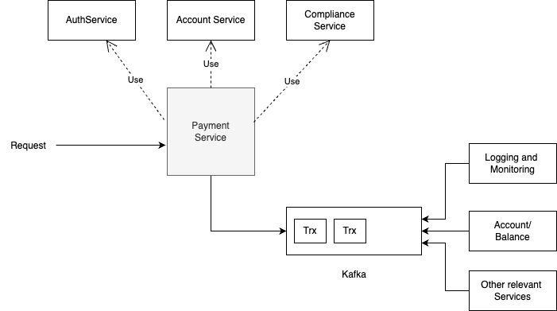
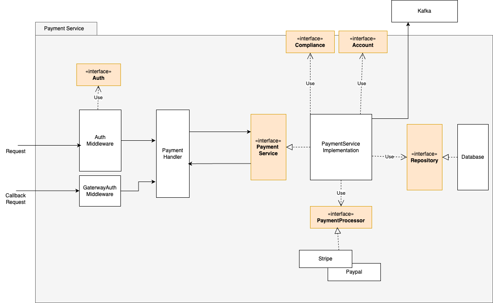

### Overview

This project is a payment gateway service that allows users to process payments using various payment gateways.
Since, this payment service is a part of a large system, I decided to make it intact
with the rest of the system using kafka as a message/event broker.
The big picture of the system looks something like this:

here, our service depends upon 3 different services inorder to perform the payment.

1. **Account Service**: This is the service that provides the user account details like balance etc.
2. **Compliance Service**: This service is responsible for checking the compliance of the user.
3. **Auth Service**: This service is responsible for providing the authentication and authorization details.

### Internal Design

Internally, The payment service is designed in a way that it is highly decoupled. I have followed hexagonal architecture in order to keep each component independent of each other. The basic idea is that each component(mainly, payment service as this is the business logic) talks to interface rather that direct dependency. With this its possible to test the behavior of the service via interface rather than specific implementation.
The reason for doing this is to make the service more flexible, scalable and testable.

The components are as follows:

1. **Handler**: This is the entry point of the service. It is responsible for receiving, and validating the request from the user that handles both JSON and SOAP request and responses.
2. **Middleware**: This is the middleware that is responsible for authorizing user and external gateway request.
3. **Payment Service**: This is the interface for the business logic of the payment service. It exposes only those functionality that is required by the handler or any other components who wants to use the payment service.
4. **payment Service**: This is the implementation of the payment service interface, where the actual business logic is implemented. This is not exposed to the outside world.
5. **Payment Gateway**: This is another Interface that is responsible for processing the payment with external payment gateway. It has its own implementation for different payment gateways like Stripe, Paypal, Revolut etc. Its highly scalable because we can add more payment gateways without changing the existing code and only by implementing the interface. Also this doesn't affect the payment service in any way.
6. **Transaction Repository**: This is interface for repository that is responsible for storing the transaction details in the database. Again, this is done to keep the payment service independent of the database.
7. **Kafka**: This is the kafka client that is responsible for sending the request to the appropriate topic for other extenal services of our overall system.
8. Other services like **Account Service**, **Compliance Service** and **Auth Service** that the payment service depends upon are also talking directly to the interface. These are Payment service facing interface which means the implementation is as per what the payment service' needs. So that when ever something changes in the other services, only the implementation changes which makes the payment service more flexible.

#### Technical Highlights

The project follows several key design patterns:

1. **Repository Pattern**:
   - Used for database operations
   - Abstracts the data persistence layer
   - Makes it easy to switch between different database implementations
   - Simplifies testing by allowing mock implementations

2. **Interface Segregation**:
   - Each external service (Account, Compliance, Auth) has its own interface
   - Interfaces are kept small and focused
   - Services only depend on the methods they actually need

3. **Factory Pattern**:
   - Used for creating payment gateway instances
   - Allows dynamic selection of payment providers
   - Makes it easy to add new payment gateways

#### Error Handling Strategy

The project implements a robust error handling mechanism using custom error types. At the core is the `ServiceError` struct which encapsulates both an error code and a message. This approach provides several benefits:

1. **Consistent Error Responses**: All errors follow a standardized format, making it easier for clients to handle errors predictably.
2. **Error Classification**: Errors are categorized using specific error codes (like `ErrorCodeValidation`, `ErrorCodeNotFound`, etc.), allowing for appropriate HTTP status code mapping.

#### Major Assumptions

1. Itempotent scenerio for **deposit** and **withdraw** is handled by passing Idempotancy-key in the header fo the request.
2. The payment gateway is already selected by the user and we are receiving the gateway_id in the request.

#### How to run the project

1. Make sure you have docker and docker compose installed.
2. Run the command `docker compose up` to start the services.
3. You can check swagger UI at `http://localhost:8080/swagger/index.html` to test the API.

#### How to test the project

 You can use `go test -v ./internals/services` to run the tests.

Note: I have added comments in the code where ever necessary to explain the context and assumptions.
